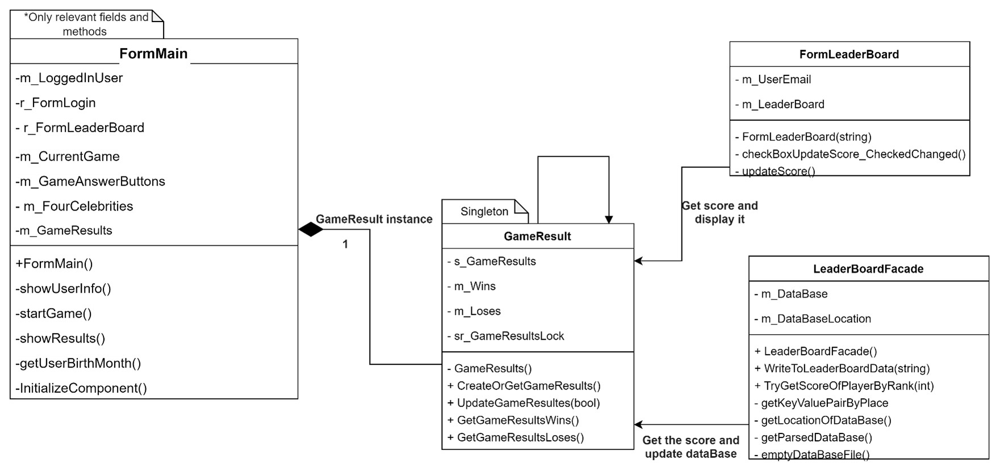

# FaceBook App

## 📝 Description
We have developed a desktop application that interfaces with Facebook’s API. The application is designed to offer the user an experience similar to that on Facebook’s official site,
incorporating a variety of classical use cases that mimic standard usage on the site, with additional features to enhance the overall user experience.
The system presents smooth user experiences even in cases of authentication failure or missing user information through the usage of Try/Catch/Finally methodology and Mock Data.

- **System Functionality**:
The system is divided into several tabs, each serving a different purpose.

## 🌐 Table of Contents
1. [Features](#-Features)
2. [Usage](#-Usage)
3. [Design Patterns Used](#-Design-Patterns)
4. [Technologies Used](#-Technologies-used)

## 🛠 Features

- **Picture Feature:**
   - Allows users to transform their profile pictures into cartoonish versions ("Toonified").
-  **Guessing Game:**
   - An interactive and engaging game based on the user’s birth month.
-  **LeaderBoard**:
   - Added to enhance user engagement by showing the scores of all participants who have played the Guessing Game.
-  **FilteredPosts**:
   -  This feature enhances user experience by allowing users to filter the type of posts they see on their home screen.
- **DarkMode**:
   - This feature enables users to switch the background of the entire system to a dark theme.
-  **Login Form**:
   - Designed a window for users to log in.
-  **Profile Tab**:
   - Displays the user's profile picture and basic information along with several interactive buttons.
-  **Resources Folder:**
   -  Contains auxiliary files intended to improve user experience.
   

## 🛠 Usage

- **Picture Feature:**
   - Integration and Usage: Incorporated using NuGet and the .NET framework via Visual Studio’s Package Manager Console. The system manages temporary saving and processing of user images, providing side-by-side comparison between the original and the ‘toonified’ image.
 **Guessing Game:**
   - Game Mechanics: The user must guess which of the celebrities were born in his/her mouth, with points being added or subtracted based on the accuracy of the guesses.
   - Data Processing: Uses Data Parsing methodology to convert extensive Database information into a manageable Dictionary format.
-  **LeaderBoard**:
   - Functionality: It retains user scores across sessions by utilizing a dedicated database, encouraging a competitive and interactive environment.
-  **FilteredPosts**:
   - Functionality: Allows users to choose from several display logics to filter the posts they see.
- **DarkMode**:
   - Accessibility: This feature is a valuable addition for improving user experience, and fulfilling the preferences and needs of users with visual impairments.
-  **Login Form**:
   - Feedback: A failure sound plays upon an unsuccessful login.
 **Profile Tab**:
   - Interaction: Features several buttons allowing users to interact with posts, groups, albums, and events.
-  **Resources Folder:**
   - Content Usage: Contains auxiliary files such as audio files, images, and a database for an incorporated game, the Guessing Game.

### 🖌 User Experience

The application, with its carefully integrated features, aims to provide a customizable, engaging, and user-centric experience, standing out as an innovative platform.
 - **Advanced Methodologies:** The application employs advanced methodologies and ensures smooth functionality and optimal user experience.
   - **Data Binding:** Employed to simplify data presentation and allow separation between the logic layer and the UI layer.
 - **Exclusive Features:** Introduces exclusive features creating enriched and improved user interaction with the platform.
   - **Interactive and User-friendly:** Offers an interactive and enjoyable experience while maintaining user-friendliness.

## 🧩 Design-Patterns

   1. Singleton
   2. Façade
   3. Static Factory Class
   4. Iterator
   5. Observer
   6. Strategy
   7. Command

### Design Pattern No. 1 – Singleton

### Reason for Using the Pattern:
The Singleton pattern is used to ensure that a class has only one instance and provides a global point of access to it. It was chosen to maintain a single, globally accessible instance of `GameResults` to store the game results of the current session. This instance is accessed by three different classes: `FormMain`, `LeaderBoardFacade`, and `FormLeaderBoard`, each having different responsibilities. Using Singleton ensures synchronized access to game results, improving runtime efficiency by avoiding redundant object creation and ensuring data consistency across different classes and threads.

### How the Pattern Solves it:
The Singleton pattern prevents multiple creations of `GameResults` and ensures any class trying to create another instance will receive the already created object. This ensures synchronized, thread-safe access, preventing overwriting of data and guaranteeing data consistency across classes.

### Implementation Method:
- **Class & Method Creation:**
   - The `GameResults` class houses the singleton with a public static function, `CreateOrGetGameResults`, allowing external access to the instance, and a private constructor preventing direct instantiation.
- **Double Check Lock Implementation:**
   - Implemented to ensure thread-safe access to object creation.
- **Helper Functions:**
   - Functions like `GetGameResultsLoses`, `GetGameResultsWins`, and `UpdateGameResults` facilitate access and modification of game results.
- **Fields:**
   - Fields like `s_GameResults`, `m_Loses`, `m_Wins`, and `sr_GameResultsLock` are added to store and manage the game results effectively.
   - 
 

## Design Pattern No. 2 – Façade

### Reason for Using the Pattern:
The Façade pattern was used to simplify the interface for the "Guessing Game", separating the computational logic and database management from the UI. This makes the system more user-friendly, hides complexities, and ensures code readability and system maintainability.

### How the Pattern Solves it:
The Façade pattern offers a simplified, unified interface (`LeaderBoardFacade`) to a set of interfaces in a subsystem, making the subsystem easier to use and promoting subsystem independence and portability.

### Implementation Method:
- **Class & Method Creation:**
   - `LeaderBoardFacade` class encapsulates the computational logic, and `FormLeaderBoard` manages UI logic and data presentation.
- **Helper Functions:**
   - Various functions handle specific computational and database management tasks.
- **UI Logic:**
   - The `FormLeaderBoard` class focuses mainly on UI interactions and leverages logic located in the façade to keep UI class coherent.
 

 ## Design Pattern No. 3 – Static Factory Class

### Reason for Using the Pattern:
This pattern was implemented to facilitate the creation of objects inheriting from `Form`. It enhances code maintainability and extensibility by allowing alterations in object creation logic without impacting the Client's code.

### How the Pattern Solves it:
It provides a unified and simplified method to create different `Form` objects, centralizing the object creation process and encapsulating the instantiation logic.

### Implementation Method:
- **Class & Method Definition:**
   - A separate `StaticFormFactory` class holds the `CreateFormFactory` function responsible for creating Forms.
- **Dynamic & Safe Creation:**
   - The factory function can safely parse the requested `Form` type from a string, allowing dynamic `Form` creation.
- **Type Handling & Error Management:**
   - The created objects are returned as type `Form`, allowing the Client side to cast to the relevant `Form` using "as".
 
 

 
 ## Design Pattern No. 4 – Iterator

### Reason for Using the Pattern:
The Iterator pattern was chosen to provide a way to access the elements of an aggregate object sequentially without exposing its underlying representation. It allows comfortable iteration over a list of famous people in the database, maintaining the legacy code, and offering flexibility and maintainability.

### How the Pattern Solves it:
It allows the `GuessingGame` class to access information conveniently without considering the specific data structure in which the details of the famous people are held.

### Implementation Method:
- **Class Creation:**
   - A `FamousPerson` class holds the details of each famous person, and `EnumerableFamousPersons` class enables iteration.
- **Efficient Iteration:**
   - Uses yield return methodology for efficient iteration and performance improvement, encapsulated within a using clause to ensure proper disposal of the iterator.
   - 
 

## Design Pattern No. 5 – Observer, Command

### Reason for Using the Pattern:
The Observer pattern was chosen to facilitate dynamic updating of controls in response to user-preferred “Dark-Mode” settings. It maintains class independency and allows seamless notification of state changes in the `DarkMode` class to subscribed classes, enhancing extendability and flexibility of the application.

### How the Pattern Solves it:
This pattern enables all subscribed observers to be notified about state changes, acting independently according to their defined responses, thus promoting high cohesion, loose coupling, and adaptability to changes.

### Implementation Method:
- **Subject Class:**
   - `DarkMode` class constitutes the Subject, maintaining a Boolean field `m_Enabled` describing the system state and string field `m_Status` saving the system status.
   - It also has a button event handler which activates methods modifying the button's appearance and notifying all listeners upon a click event.
- **Observer Subscription & Notification:**
   - `FormMain` class subscribes to `m_ReportClickedDelegates` and associates it with the `DisplayModeChange` method to be activated upon receiving notifications.
   - `notifyClickObservers` method employs null checks and invoke to notify existing subscribers safely.
- **Independent Action:**
   - Each observer acts independently in response to notifications, performing actions defined within their scope.

## Design Pattern No. 6 – Strategy

### Reason for Using the Pattern:
The Strategy pattern was utilized for the `FilteredPost` feature, allowing users diverse filtering options for their Facebook posts, such as viewing all posts, posts from the last month, or posts with more than ten likes. This facilitates future extensions by enabling the addition of more filtering logic without affecting existing classes, thereby promoting maintainability, flexibility, and reusability.

### How the Pattern Solves it:
This pattern encapsulates different filtering logics within separate classes, each implementing a common interface, making the system modular and promoting loose coupling between classes using the logic and those implementing it.

### Implementation Method:
- **Interface & Classes:**
   - A `IFilterStrategy` interface with a `Select` method is defined, and three classes: `ShowAllFilter`, `MoreThanTenLikesFilter`, and `LastMonthFilter` implement this interface, each encapsulating a unique filter logic.
   - A `FilterStrategy` class holds a composition instance of `IFilterStrategy`.
- **Application of Strategy:**
   - An instance of `FilterStrategy` is created in `FormMain` and the user's choice determines the type of filter it holds in composition.
   - This instance is passed to the `fetchFilteredPosts` method to display posts according to the chosen strategy.
- **Utilizing LINQ:**
   - `MoreThanTenLikesFilter` and `LastMonthFilter` implement the `Select` function using LINQ for improved performance, readability, and maintainability.

## 🛠️ Technologies Used
- **C#: Implements strong typing and object-oriented principles.
- **Visual Studio Forms: Enables graphical user interface for intuitive user interaction.
- **LINQ: Employed for efficient data querying and manipulation in-game status verification.
- **.NET Technologies: Provide a versatile development and execution environment.
